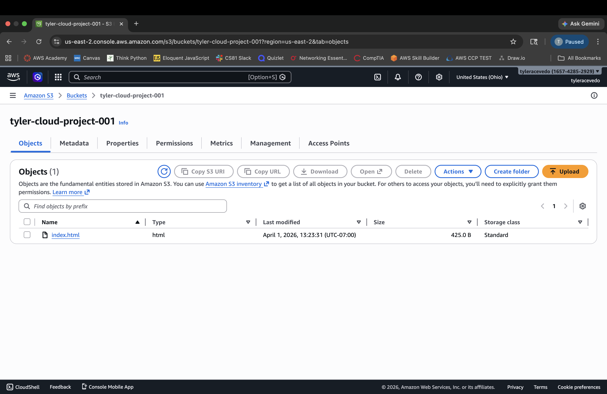
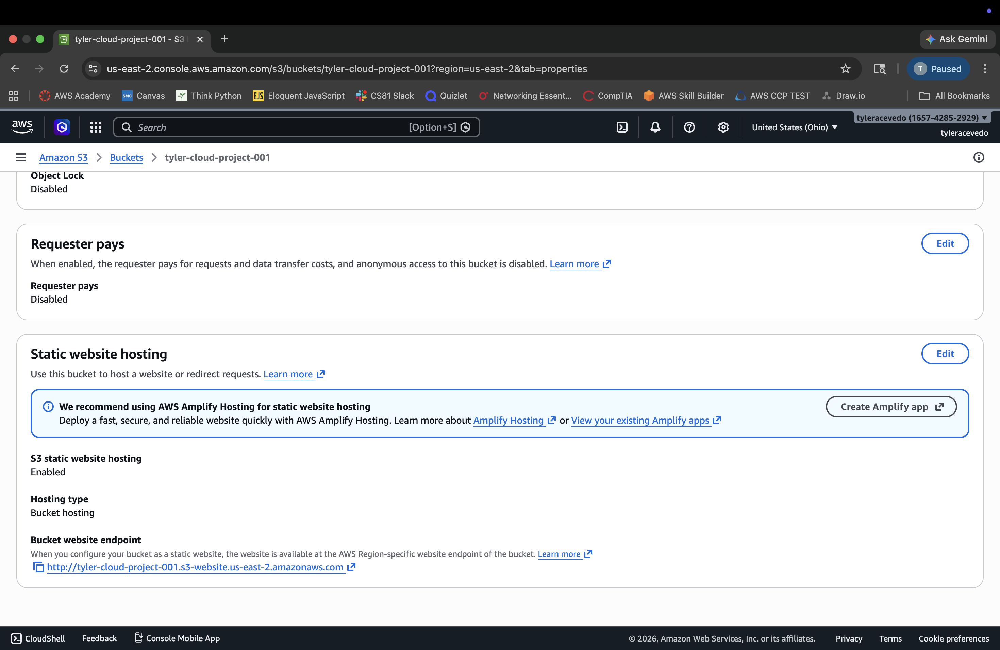
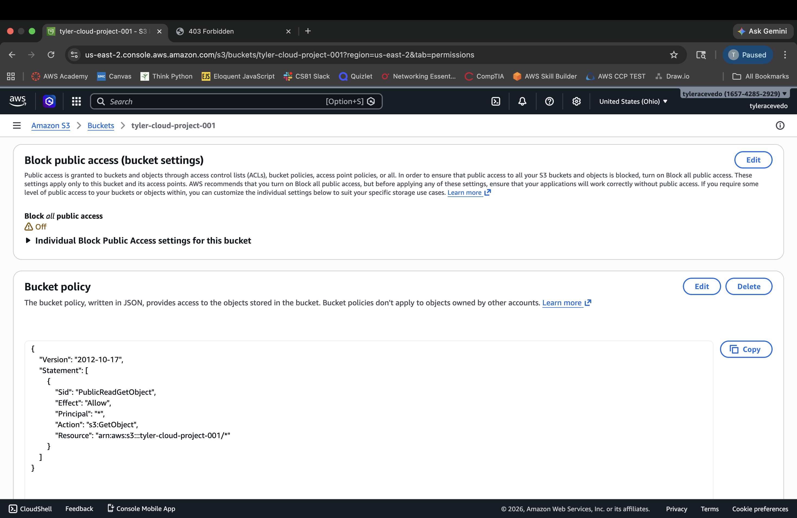
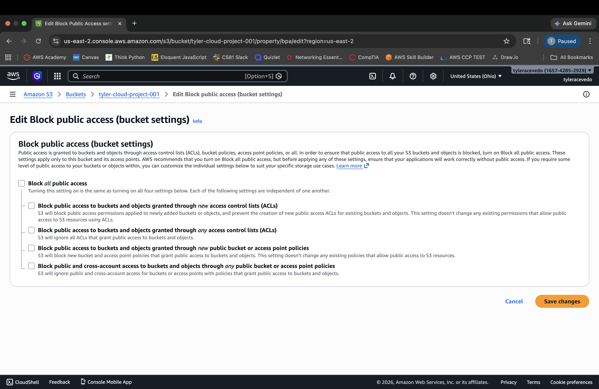
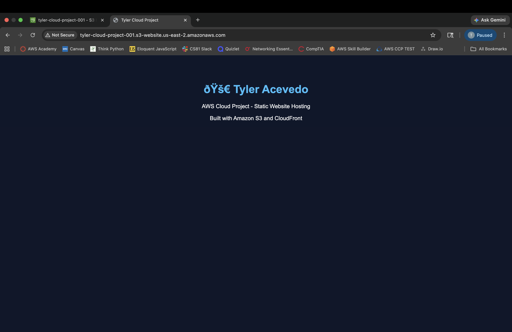
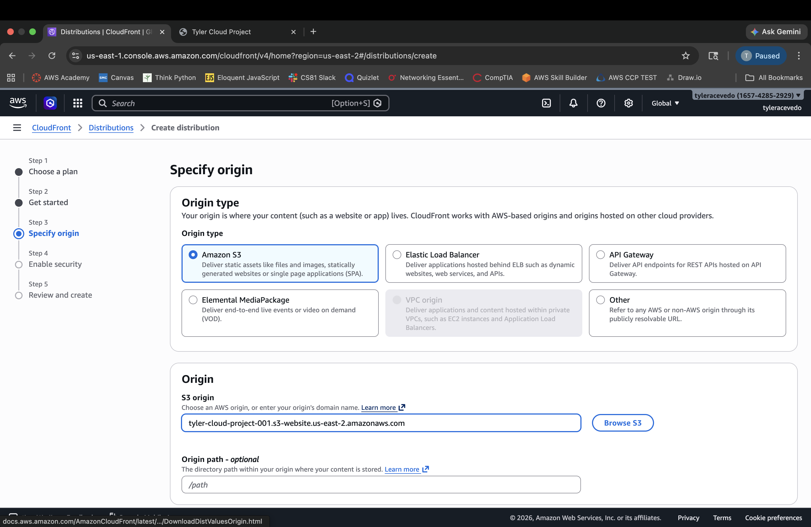
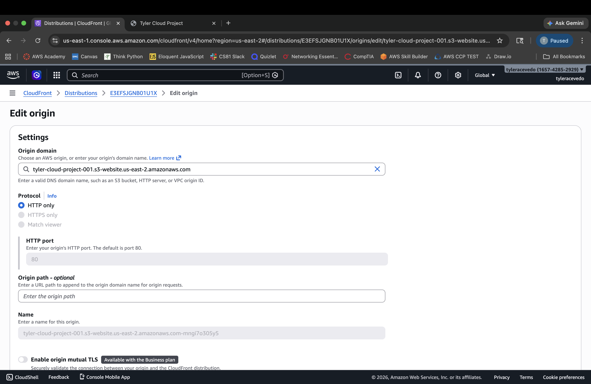
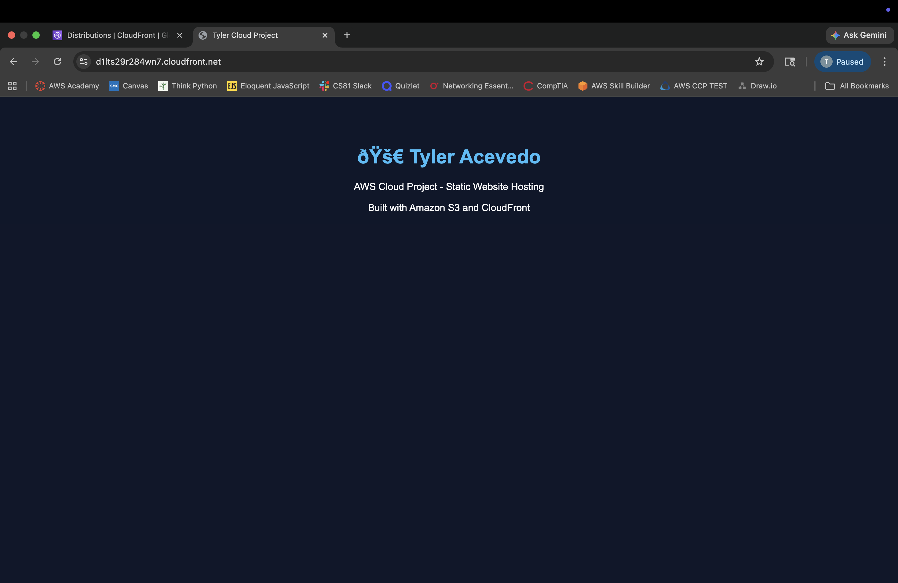

# aws-static-website-project
Deployed a static website using AWS S3 and CloudFront

# AWS Static Website Hosting Project 🚀

## Project Overview
This project demonstrates how to deploy a scalable and cost-efficient static website using AWS cloud services.

## Business Scenario
A small business needs a fast, reliable, and low-cost website solution that can be accessed globally without managing servers.

## Solution
I built a serverless website using Amazon S3 for storage and Amazon CloudFront as a content delivery network (CDN) to improve performance and availability.

## Architecture
- Amazon S3 (static website hosting)
- Amazon CloudFront (global content delivery)

## Services Used
- Amazon S3
- Amazon CloudFront

## Steps

### 1. Create S3 Bucket

### 2. Configure Static Website Hosting

### 3. Set Bucket Policy

### 4. Enable Public Access

### 5. Access Website via S3 Endpoint

### 6. Create CloudFront Distribution

### 7. Set Origin Protocol

### 8. Access Website via CloudFront

## Key Learnings
- How object storage can replace traditional web servers
- How CDNs improve latency and performance
- How cloud solutions reduce infrastructure costs

## Business Impact
This solution eliminates the need for server management, reduces infrastructure costs, and delivers fast content globally.

## Future Improvements
- Add custom domain using Route 53
- Implement SSL certificate customization
- Add CI/CD pipeline for automated deployments
